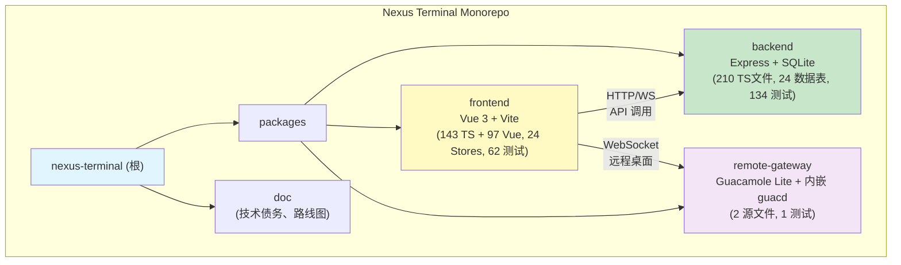
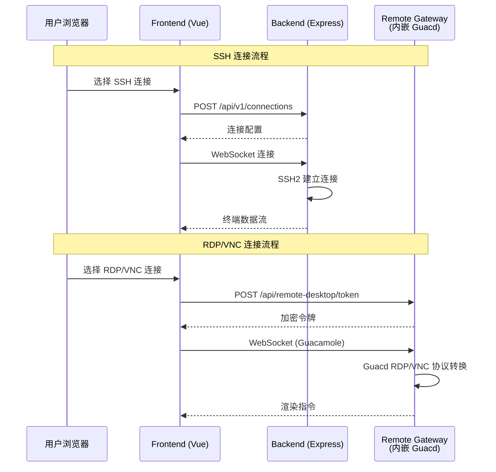

# 星枢终端（Nexus Terminal）

> 现代化、功能丰富的 Web SSH / RDP / VNC 客户端，提供高度可定制的远程连接体验

---

## 变更记录

### 2026-05-08 (安全漏洞修复)

- **SSRF 防护 (CRITICAL)**：新增 `utils/url.ts` 共享 SSRF 校验函数，DNS 解析后检查 IP 是否指向私网，应用于 `appearance.service.ts` 和 `nl2cmd.service.ts`
- **命令注入防护 (HIGH)**：`docker-security.ts` 改用白名单验证替代字符剥离；`batch.service.ts` 新增 `sanitizeBatchCommand()` 阻止 shell 元字符
- **路径穿越防护 (HIGH)**：3 个文件（`appearance.controller.ts`、`terminal-theme.controller.ts`、`temporary-log-storage.service.ts`）添加 `path.resolve()` + `startsWith()` 校验
- **ReDoS 防护 (HIGH)**：`appearance.service.ts` GitHub URL 正则 `(.*?)` → `[^?#]*` 消除灾难性回溯
- **日志格式优化**：pino 添加 `formatters.level` 文字等级输出，`base: {}` 移除 pid/hostname

### 2026-05-06 (日志统一改造)

- **后端日志统一**：console 猴子补丁移除，统一到 pino 单一引擎
  - `utils/logger.ts`：pino + pino-pretty（dev），支持 `LOG_TZ` 时区、`LOG_LEVEL` 运行时动态调整
  - `logging/redaction.ts`：16 个正则的敏感信息脱敏，支持循环引用检测
  - 94 个后端源文件、~1,426 处 console 调用迁移到 logger
- **前端日志统一**：新增 `utils/log.ts`，`import.meta.env.DEV` 守卫在生产构建时自动剥离
  - 138 个前端源文件、1,335 处 console 调用迁移到 log
  - 支持 `?log=debug` URL 参数激活 debug 级别输出
- **测试修复**：15 个测试文件的 console spy 更新为 logger mock
- **审查修复**：
  - Greptile P1：`/key/i` 正则恢复（覆盖 sshKey/signingKey）、`isLogRedactEnabled()` 延迟求值
  - CodeRabbit：`redaction.ts` 中 `instanceof Error` 检查提前到 `Object.keys` 之前，防止系统错误被转为普通对象
  - Codex P1：Dockerfile 添加 `ENV NODE_ENV=production`，防止生产构建加载 pino-pretty 崩溃
  - cubic-dev-ai P2：logger wrapper 自动追加多余字符串到 message（修复 pino 丢弃无 `%s` 参数）；error.middleware.ts 7 行日志合并为结构化单行
- **验证结果**：后端 134 文件 / 2,283 测试通过，前端 62 文件 / 1,616 测试通过，生产构建 console 调用为 0

### 2026-05-03 (文档与技术债务全面治理)

- **技术债务清零**：84 项债务全部修复（收敛率 100%），含 Codex 审查补漏 7 项
- **文件统计更新**：
  - Backend: 207 个 TypeScript 源文件，127 个测试文件
  - Frontend: 240 个源文件（143 TS + 97 Vue），62 个测试文件
  - Remote Gateway: 2 个源文件，1 个测试文件
  - 总计: 449 个源代码文件 + 190 个测试文件
- **测试覆盖率**：
  - Backend: 127 个测试文件（单元测试 + 集成测试 + 性能测试）
  - Frontend: 62 个测试文件（组件、Store、Composables 测试）
  - E2E: 8 个 Playwright 测试规范
  - Remote Gateway: 1 个测试文件

### 2026-04-28 (架构文档增量扫描更新)

- **文件统计更新**：
  - Backend: 192 个 TypeScript 源文件，118 个测试文件（保持稳定）
  - Frontend: 187 个源文件（99 TS + 88 Vue），39 个测试文件（+2，增长 5%）
  - Remote Gateway: 2 个源文件，1 个测试文件
  - 总计: 381 个源代码文件 + 158 个测试文件
- **测试覆盖率**：
  - Backend: 118 个测试文件（单元测试 + 集成测试 + 性能测试）
  - Frontend: 39 个测试文件（组件、Store、Composables 测试）
  - E2E: 8 个 Playwright 测试规范
  - Remote Gateway: 1 个测试文件
- **覆盖率**：100% 模块文档化完成
- **扫描策略**：阶段 A（全仓清点）+ 阶段 B（模块优先扫描）+ 阶段 C（深度补捞）

### 2026-04-24 (架构文档全量扫描更新)

- **文件统计更新**：
  - Backend: 192 个 TypeScript 源文件（+71，增长 59%），118 个测试文件
  - Frontend: 187 个源文件（99 TS + 88 Vue），37 个测试文件，24 个 Pinia stores，22 个路由模块
  - Remote Gateway: 2 个源文件，1 个测试文件
  - 总计: 381 个源代码文件 + 164 个测试文件
- **数据库 Schema**：24 个数据表（新增 ip_geo_cache）
- **测试覆盖率**：
  - Backend: 118 个测试文件（单元测试 + 集成测试 + 性能测试）
  - Frontend: 37 个测试文件（组件、Store、Composables 测试）
  - E2E: 8 个 Playwright 测试规范
  - Remote Gateway: 1 个测试文件
- **覆盖率**：100% 模块文档化完成

### 2026-01-31 (架构文档增量更新)

- **文件统计更新**：
  - Backend: 121 个 TypeScript 文件（+13 测试文件），516+ 导出符号
  - Frontend: 184 个 TypeScript/Vue 文件（+4 测试文件），531+ 导出符号
  - 总计: 306 个源代码文件
- **测试覆盖率提升**：
  - Backend: 72+ 测试文件（新增 WebSocket Handlers、认证中间件、加密模块测试）
  - Frontend: 31+ 测试文件（新增 TerminalPreview、AI/Batch stores 测试）
  - E2E: 8 个测试规范（新增边缘场景覆盖）
- **新增功能记录**：
  - 统一缓存管理器（CacheManager）
  - 统一错误消息提取器（ErrorExtractor）
  - ConnectionList 虚拟滚动（@vueuse/core）
  - TerminalPreview 实时预览组件
  - 应用启动性能优化（统一初始化 API）
  - SFTP 模块重构（BaseRepository 抽象基类）
  - SSH 终端输入延迟优化（98% 性能提升）
  - 强制键盘交互式认证（keyboard-interactive）
- **数据库 Schema 更新**：24 个数据表（新增 force_keyboard_interactive 字段）
- **覆盖率**：100% 模块文档化完成

### 2026-01-04 (项目 AI 上下文初始化 - 自适应扫描)

- **架构文档更新**：完成项目全局架构扫描与文档更新
- **模块统计更新**：
  - Backend: 121 个 TypeScript 文件，516+ 类型/类/接口导出，23 个数据表
  - Frontend: 51 个 TypeScript 核心文件，531+ 类型/类/接口导出，24 个 Pinia stores，13 个视图路由
  - Remote Gateway: 单一入口文件，轻量化网关服务
- **测试覆盖率统计**：
  - Backend: 59+ 测试文件（单元测试 + 集成测试）
  - Frontend: 27+ 测试文件（单元测试 + E2E 测试）
  - Remote Gateway: 1 测试文件
- **数据库 Schema 完整性**：识别 23 个业务表 + 1 个迁移管理表
- **扫描策略**：阶段 A（全仓清点）+ 阶段 B（模块优先扫描）
- **覆盖率**：100% 模块文档化完成

### 历史变更

详见 [CHANGELOG.md](./CHANGELOG.md)

---

## 项目愿景

星枢终端致力于提供一个现代化、轻量级且功能完备的 Web 远程管理平台，支持：

- **多协议连接**：SSH、SFTP、RDP、VNC
- **多标签管理**：在单一浏览器窗口管理多个远程会话
- **会话挂起与恢复**：网络断开后自动保持会话，随时恢复
- **高度可定制**：终端主题、布局、背景动效、键盘映射
- **审计与监控**：完整的用户行为日志、通知系统（Webhook/Email/Telegram）
- **智能运维**：AI 智能助手、批量命令执行、系统健康分析
- **轻量化部署**：基于 Node.js 后端，资源占用低，支持 Docker 一键部署

---

## 架构总览

### 技术栈

- **前端**：Vue 3 + TypeScript + Vite + Pinia + Element Plus + Xterm.js + Monaco Editor
- **后端**：Node.js + Express + TypeScript + SQLite3 + SSH2 + WebSocket
- **远程桌面网关**：Guacamole Lite + Express + WebSocket
- **部署**：Docker Compose + Nginx 反向代理

### 架构模式

- **Monorepo**：npm workspaces 管理三个子包
- **前后端分离**：RESTful API + WebSocket 实时通信
- **微服务架构**：后端服务、前端应用、远程网关独立容器化部署

### 核心能力

1. **会话管理**：支持 SSH 会话挂起/恢复、多标签页管理、自动重连
2. **文件管理**：基于 SFTP 的文件管理器，支持拖拽上传、多选、权限管理
3. **终端能力**：Xterm.js 提供全功能终端模拟，支持自定义主题、字体、快捷键
4. **远程桌面**：通过 Guacamole 协议代理 RDP/VNC 连接
5. **安全与审计**：用户认证、会话管理、IP 访问控制、行为审计日志
6. **通知系统**：可配置的多渠道通知（登录提醒、异常告警）
7. **容器管理**：内置简易 Docker 容器运维面板
8. **智能运维**：AI 智能分析、批量命令执行（Phase 4/5）

---

## 模块结构图



### 模块通信流程图



---

## 模块索引

| 模块名称           | 路径                      | 语言/框架               | TS 文件数 | 职责描述                                                                | 文档入口                                                        |
| ------------------ | ------------------------- | ----------------------- | --------- | ----------------------------------------------------------------------- | --------------------------------------------------------------- |
| **backend**        | `packages/backend`        | TypeScript / Express.js | 207       | 后端 API 服务：SSH/SFTP 连接、用户认证、审计日志、通知、Docker 管理等   | [backend/CLAUDE.md](./packages/backend/CLAUDE.md)               |
| **frontend**       | `packages/frontend`       | TypeScript / Vue 3      | 240       | 前端 Web 应用：终端界面、文件管理器、连接管理、主题定制、路由与状态管理 | [frontend/CLAUDE.md](./packages/frontend/CLAUDE.md)             |
| **remote-gateway** | `packages/remote-gateway` | TypeScript / Express.js | 2         | 远程桌面网关：RDP/VNC 连接代理，基于 Guacamole 协议                     | [remote-gateway/CLAUDE.md](./packages/remote-gateway/CLAUDE.md) |

### 规划文档

| 文档                                                       | 描述                                                                                                                           |
| ---------------------------------------------------------- | ------------------------------------------------------------------------------------------------------------------------------ |
| [PERSONAL_ROADMAP.md](./doc/PERSONAL_ROADMAP.md)           | **个人版功能规划**：Phase 6-11 详细实施计划，包含命令模板、工作区快照、AI 推荐、知识库等功能的数据库设计、模块架构、工作量评估 |
| [TECHNICAL_DEBT_REPORT.md](./doc/TECHNICAL_DEBT_REPORT.md) | **技术债务报告**：84 项债务全部清零（收敛率 100%），含 Critical/High/Medium/Low 四级分类与 Codex 审查补漏                      |

---

## 运行与开发

### 快速启动（Docker）

```bash
# 1. 下载配置文件
mkdir nexus-terminal && cd nexus-terminal
wget https://raw.githubusercontent.com/Silentely/nexus-terminal/refs/heads/main/docker-compose.yml
wget https://raw.githubusercontent.com/Silentely/nexus-terminal/refs/heads/main/.env

# 2. 启动服务
docker compose up -d

# 3. 访问应用（默认端口 18111）
# 浏览器打开 http://localhost:18111
```

### 本地开发

```bash
# 安装依赖（根目录执行，会自动安装所有子包）
npm install

# 启动后端开发服务器（端口 3001）
cd packages/backend
npm run dev

# 启动前端开发服务器（端口 5173）
cd packages/frontend
npm run dev

# 启动远程网关开发服务器（端口 8080/9090）
cd packages/remote-gateway
npm run dev
```

### 构建生产版本

```bash
# 构建后端
cd packages/backend
npm run build
npm start

# 构建前端
cd packages/frontend
npm run build
```

### 环境变量配置

- **根目录 `.env`**：定义部署模式、端口等全局配置
- **data/.env**：定义后端加密密钥、Guacamole 连接信息（自动生成）
- **关键变量**：
  - `ENCRYPTION_KEY`：数据库敏感信息加密密钥（32字节 hex，支持密钥轮换）
  - `SESSION_SECRET`：会话密钥（自动生成）
  - `GUACD_HOST` / `GUACD_PORT`：Guacamole daemon 地址（默认 localhost:4822）
  - `ENABLE_GEO_LOOKUP`：登录事件 IP 地理位置查询开关（默认 true）
  - `RP_ID` / `RP_ORIGIN`：Passkey 登录配置
- **安全配置常量**：详见 [Backend CLAUDE.md](./packages/backend/CLAUDE.md#安全配置常量srcconfgsecurityconfigts)

---

## 测试策略

### 当前状态

- **测试框架已配置**：Backend 与 Frontend 均已配置完整测试框架
- **测试覆盖率**（2026-05-03 更新）：
  - Backend: 127 个 `*.test.ts` 文件（单元测试 + 集成测试 + 性能测试）
  - Frontend: 62 个 `*.test.ts` 文件（组件、Store、Composables 测试）
  - E2E: 8 个 `*.spec.ts` 文件（边缘场景覆盖）
  - Remote Gateway: 1 个 `*.test.ts` 文件
- **测试类型覆盖**：
  - 单元测试（Vitest）
  - 集成测试（SSH/SFTP/RDP/VNC 协议模拟）
  - E2E 测试（Playwright）
  - 性能测试（Autocannon）

### 测试框架配置

- **单元测试 (Vitest)**：
  - 后端：Vitest + @vitest/coverage-v8（配置：`packages/backend/vitest.config.ts`）
  - 前端：Vitest + Vue Test Utils + Happy DOM（配置：`packages/frontend/vite.config.ts`）
- **E2E 测试 (Playwright)**：
  - 配置文件：`packages/frontend/e2e/playwright.config.ts`
  - 支持浏览器：Chromium、Firefox、WebKit
  - Page Object Model：`e2e/pages/`（login、workspace、settings）
  - 测试 Fixtures：`e2e/fixtures/`（认证状态、测试数据）
- **集成测试**：
  - SSH/SFTP Mock 服务器：`packages/backend/tests/integration/ssh/mock-ssh-server.ts`
  - Guacamole 协议测试：`packages/backend/tests/integration/guacamole/`
- **性能测试**：
  - 配置文件：`packages/backend/tests/performance/concurrent-connections.test.ts`
  - 工具：Autocannon

### 测试命令

```bash
# 类型检查（前端强制执行，包含测试文件）
npm run typecheck                   # 前端类型检查（vue-tsc --noEmit）

# 单元测试
npm test                            # 运行所有单元测试
npm run test:backend                # 运行后端测试
npm run test:remote-gateway         # 运行远程网关测试
npm run test:frontend               # 运行前端测试
npm run test:watch:backend          # 后端监视模式
npm run test:watch:remote-gateway   # 远程网关监视模式
npm run test:watch:frontend         # 前端监视模式
npm run test:coverage               # 生成覆盖率报告

# E2E 测试
npm run test:e2e                    # 运行 E2E 测试（无头模式）
npm run test:e2e:ui                 # Playwright UI 模式（交互式调试）
npm run test:e2e:headed             # 有头模式（可见浏览器）

# 性能测试
npm run test:perf                   # 运行性能测试
npm run test:perf:watch             # 性能测试监视模式

# 首次运行 E2E 测试前需安装浏览器
npx playwright install
```

### 类型检查要求

- **前端项目**：使用 `vue-tsc --noEmit` 进行严格类型检查，构建流程中强制执行
- **后端项目**：使用 `tsc --noEmit` 进行类型检查
- **测试文件**：同样需要通过类型检查，Mock 数据必须完整匹配类型定义
- **类型断言**：Vue Test Utils 中使用 `as HTMLInputElement` 处理 DOM 属性，`as any` 处理私有方法

### 测试目录结构

```
packages/
├── backend/tests/
│   ├── integration/
│   │   ├── ssh/                  # SSH 集成测试
│   │   │   ├── mock-ssh-server.ts
│   │   │   └── ssh.integration.test.ts
│   │   ├── sftp/                 # SFTP 集成测试
│   │   │   └── sftp.integration.test.ts
│   │   └── guacamole/            # RDP/VNC 代理测试
│   │       ├── guacamole.service.test.ts
│   │       └── rdp-proxy.test.ts
│   ├── performance/              # 性能测试
│   │   └── concurrent-connections.test.ts
│   └── unit/                     # 单元测试（与源码同目录）
│
├── frontend/
│   ├── e2e/                      # Playwright E2E 测试
│   │   ├── playwright.config.ts
│   │   ├── fixtures/
│   │   ├── pages/
│   │   └── tests/
│   │       ├── auth.spec.ts
│   │       ├── ssh-connection.spec.ts
│   │       ├── sftp-operations.spec.ts
│   │       ├── remote-desktop.spec.ts
│   │       ├── auth-edge-cases.spec.ts
│   │       ├── connection-edge-cases.spec.ts
│   │       ├── file-management-edge-cases.spec.ts
│   │       └── terminal-edge-cases.spec.ts
│   └── src/**/*.test.ts          # 单元测试（与源码同目录）
│
└── remote-gateway/tests/
    └── server.test.ts            # 网关服务器测试
```

### 测试编写规范

本节基于代码库中现有测试用例总结，所有新增测试必须遵循以下规范。

#### 文件命名与位置

- **单元测试**：与被测文件同目录，命名为 `*.test.ts`（如 `auth.service.test.ts`）
- **集成测试**：放置于 `tests/integration/{功能}/` 目录
- **E2E 测试**：放置于 `e2e/tests/` 目录，命名为 `*.spec.ts`

#### 测试结构规范

```typescript
// 使用中文描述测试套件和用例
describe('服务名称', () => {
  // 前置设置
  beforeEach(() => {
    vi.clearAllMocks();
  });

  describe('方法名或功能分组', () => {
    it('应该 [预期行为描述]', async () => {
      // Arrange - 准备测试数据
      // Act - 执行被测方法
      // Assert - 验证结果
    });
  });
});
```

#### 后端 Service 测试规范

```typescript
import { describe, it, expect, beforeEach, vi } from 'vitest';
import { SomeService } from './some.service';
import { SomeRepository } from './some.repository';

// Mock Repository 层
vi.mock('./some.repository', () => ({
  SomeRepository: {
    findAll: vi.fn(),
    findById: vi.fn(),
    create: vi.fn(),
    update: vi.fn(),
    delete: vi.fn(),
  },
}));

describe('SomeService', () => {
  beforeEach(() => {
    vi.clearAllMocks();
  });

  describe('findAll', () => {
    it('应该返回所有记录', async () => {
      const mockData = [{ id: 1, name: 'test' }];
      vi.mocked(SomeRepository.findAll).mockResolvedValue(mockData);

      const result = await SomeService.findAll();

      expect(result).toEqual(mockData);
      expect(SomeRepository.findAll).toHaveBeenCalledTimes(1);
    });
  });
});
```

#### 前端 Pinia Store 测试规范

```typescript
import { describe, it, expect, beforeEach, vi } from 'vitest';
import { setActivePinia, createPinia } from 'pinia';
import { useSomeStore } from './some.store';

describe('SomeStore', () => {
  beforeEach(() => {
    // 每个测试前重新创建 Pinia 实例
    setActivePinia(createPinia());
  });

  it('应该有正确的初始状态', () => {
    const store = useSomeStore();
    expect(store.someState).toBe(initialValue);
  });

  it('应该正确执行 action', async () => {
    const store = useSomeStore();
    await store.someAction();
    expect(store.someState).toBe(expectedValue);
  });
});
```

#### 前端 Vue 组件测试规范

```typescript
import { describe, it, expect, beforeEach, vi } from 'vitest';
import { mount, VueWrapper } from '@vue/test-utils';
import { createPinia, setActivePinia } from 'pinia';
import SomeComponent from './SomeComponent.vue';

// Mock 依赖的 Composables
vi.mock('@/composables/useSomeComposable', () => ({
  useSomeComposable: () => ({
    someMethod: vi.fn(),
    someState: ref(initialValue),
  }),
}));

describe('SomeComponent', () => {
  let wrapper: VueWrapper;

  beforeEach(() => {
    setActivePinia(createPinia());
    wrapper = mount(SomeComponent, {
      global: {
        plugins: [createPinia()],
        stubs: ['el-button', 'el-input'], // Stub Element Plus 组件
      },
      props: {
        someProp: 'value',
      },
    });
  });

  it('应该正确渲染', () => {
    expect(wrapper.exists()).toBe(true);
  });

  it('应该响应用户交互', async () => {
    await wrapper.find('button').trigger('click');
    expect(wrapper.emitted('someEvent')).toBeTruthy();
  });
});
```

#### 集成测试 Mock 服务器规范

```typescript
import { EventEmitter } from 'events';

// 继承 EventEmitter 实现事件机制
export class MockSomeServer extends EventEmitter {
  private config: MockConfig;

  constructor(config: MockConfig) {
    super();
    this.config = config;
  }

  async start(): Promise<{ host: string; port: number }> {
    // 初始化逻辑
    return { host: '127.0.0.1', port: this.port };
  }

  async stop(): Promise<void> {
    // 清理逻辑
  }
}

// 工厂函数创建 Mock 客户端
export function createMockClient(address: { host: string; port: number }) {
  const client = new EventEmitter() as any;
  client.connect = vi.fn().mockImplementation(() => {
    setTimeout(() => client.emit('ready'), 10);
    return client;
  });
  return client;
}
```

#### 断言规范

| 场景           | 推荐断言                            | 示例                                          |
| -------------- | ----------------------------------- | --------------------------------------------- |
| 值相等         | `expect().toBe()`                   | `expect(result).toBe(5)`                      |
| 对象深度相等   | `expect().toEqual()`                | `expect(obj).toEqual({ a: 1 })`               |
| 数组包含元素   | `expect().toContain()`              | `expect(arr).toContain('item')`               |
| 对象包含属性   | `expect().toHaveProperty()`         | `expect(obj).toHaveProperty('key', 'value')`  |
| 函数被调用     | `expect().toHaveBeenCalled()`       | `expect(mockFn).toHaveBeenCalled()`           |
| 函数调用参数   | `expect().toHaveBeenCalledWith()`   | `expect(mockFn).toHaveBeenCalledWith('arg')`  |
| Promise 成功   | `expect().resolves`                 | `await expect(promise).resolves.toBe(value)`  |
| Promise 失败   | `expect().rejects`                  | `await expect(promise).rejects.toThrow()`     |
| 抛出异常       | `expect().toThrow()`                | `expect(() => fn()).toThrow('error message')` |
| 正则匹配       | `expect().toMatch()`                | `expect(str).toMatch(/pattern/)`              |
| 类型检查       | `expect().toBeInstanceOf()`         | `expect(obj).toBeInstanceOf(SomeClass)`       |
| 真值/假值      | `expect().toBeTruthy()/toBeFalsy()` | `expect(value).toBeTruthy()`                  |
| null/undefined | `expect().toBeNull()/toBeDefined()` | `expect(value).toBeDefined()`                 |

#### Mock 策略

| 依赖类型     | Mock 方式                                         |
| ------------ | ------------------------------------------------- |
| Repository   | `vi.mock('./some.repository')` + `vi.mocked()`    |
| 外部 API     | `vi.mock('axios')` 或 MSW (Mock Service Worker)   |
| Pinia Store  | `setActivePinia(createPinia())` + 直接操作 store  |
| Composables  | `vi.mock('@/composables/...')` 返回 mock 对象     |
| 定时器       | `vi.useFakeTimers()` + `vi.advanceTimersByTime()` |
| 环境变量     | `vi.stubEnv('VAR_NAME', 'value')`                 |
| Node 模块    | `vi.mock('fs')` / `vi.mock('path')`               |
| EventEmitter | 继承 EventEmitter 创建 Mock 类                    |

#### E2E 测试规范 (Playwright)

```typescript
import { test, expect } from '@playwright/test';
import { LoginPage } from '../pages/login.page';

test.describe('登录功能', () => {
  test('应该成功登录并跳转到仪表盘', async ({ page }) => {
    const loginPage = new LoginPage(page);
    await loginPage.goto();
    await loginPage.login('username', 'password');

    await expect(page).toHaveURL('/dashboard');
  });
});

// Page Object Model
class LoginPage {
  constructor(private page: Page) {}

  async goto() {
    await this.page.goto('/login');
  }

  async login(username: string, password: string) {
    await this.page.fill('[data-testid="username"]', username);
    await this.page.fill('[data-testid="password"]', password);
    await this.page.click('[data-testid="submit"]');
  }
}
```

#### 测试覆盖率要求

| 模块类型   | 行覆盖率目标 | 分支覆盖率目标 |
| ---------- | ------------ | -------------- |
| Service    | >=80%        | >=70%          |
| Controller | >=70%        | >=60%          |
| Repository | >=60%        | >=50%          |
| Utils      | >=90%        | >=80%          |
| Store      | >=80%        | >=70%          |
| Component  | >=60%        | >=50%          |

---

## 编码规范

### 语言与格式

- **语言**：TypeScript（严格模式）
- **代码风格**：基于项目内现有约定（建议配置 ESLint + Prettier）
- **命名约定**：
  - 文件名：`kebab-case`（如 `auth.controller.ts`）
  - 类名/接口：`PascalCase`
  - 变量/函数：`camelCase`
  - 常量：`UPPER_SNAKE_CASE`

### 架构约定

- **模块化**：后端按业务领域划分目录（`auth/`、`connections/`、`sftp/` 等）
- **分层架构**：
  - `routes.ts`：路由定义
  - `controller.ts`：请求处理与参数校验
  - `service.ts`：业务逻辑
  - `repository.ts`：数据访问
- **前端组合式 API**：Vue 3 使用 Composition API + Pinia stores
- **类型定义**：所有 API 交互与状态定义需有 TypeScript 类型

### 依赖管理

- **锁定版本**：生产依赖版本应在 `package.json` 中明确
- **安全更新**：定期检查依赖漏洞（`npm audit`）
- **避免重复**：跨模块共享依赖提升至根 `package.json`

---

## AI 使用指引

### 上下文注入优先级

1. **优先读取**：
   - 根 `CLAUDE.md`（本文件）：获取全局架构与规范
   - 模块 `CLAUDE.md`：获取具体模块的实现细节
   - `.claude/index.json`：获取模块索引与覆盖率信息
2. **按需读取**：
   - 数据模型定义：`packages/backend/src/database/schema.ts`
   - API 路由定义：`packages/backend/src/*/routes.ts`
   - 前端路由与状态：`packages/frontend/src/router/`、`packages/frontend/src/stores/`
   - 类型定义：`packages/*/src/types/*.ts`

### 任务执行建议

- **新增功能**：
  1. 先读取相关模块的 `CLAUDE.md` 了解现有架构
  2. 在对应模块的目录下创建新文件（遵循现有命名与分层约定）
  3. 更新模块 `CLAUDE.md` 的"相关文件清单"与"变更记录"
- **修改功能**：
  1. 识别影响范围（前端/后端/数据库）
  2. 读取相关文件的当前实现
  3. 修改后运行本地测试（如有）
  4. 更新相关文档与 Changelog
- **Bug 修复**：
  1. 在 `.claude/index.json` 中记录问题发现时间与描述
  2. 定位问题根源（日志、代码逻辑）
  3. 修复后更新测试用例（如适用）

### 提示词模板

#### 新增 API 端点

```
请在 backend 模块中新增一个 API 端点，用于[功能描述]。
- 路由路径：/api/v1/[资源名]
- HTTP 方法：[GET/POST/PUT/DELETE]
- 请求参数：[参数列表与类型]
- 响应格式：[JSON 结构]
- 数据表：[涉及的数据库表，如需新增表则提供 SQL schema]
- 权限要求：[是否需要认证中间件]

参考现有实现：packages/backend/src/[类似模块]
```

#### 新增前端组件

```
请在 frontend 模块中新增一个 Vue 组件，用于[功能描述]。
- 组件名称：[PascalCase]
- 放置路径：packages/frontend/src/components/[目录]/
- 依赖的 Store：[Pinia store 名称]
- 接口集成：[调用的后端 API]
- 样式要求：[Tailwind CSS 类或自定义样式]
- 交互逻辑：[用户操作流程]

参考现有实现：packages/frontend/src/components/[类似组件]
```

#### 数据库迁移

```
请添加数据库迁移，用于[描述变更内容]。
- 变更类型：[新增表/修改列/索引优化]
- SQL 语句：[提供 SQLite DDL]
- 影响的模块：[backend 中哪些 repository/service 需要同步更新]
- 数据兼容性：[如何处理已有数据]

修改文件：
- packages/backend/src/database/schema.ts
- packages/backend/src/database/migrations.ts
```

---

## AI 协作最佳实践

1. **上下文优先**：任务开始前，主动提供相关模块的 `CLAUDE.md` 和关键文件路径
2. **变更记录**：每次变更后，在模块 `CLAUDE.md` 顶部添加 Changelog 条目
3. **覆盖率跟踪**：修改后更新 `.claude/index.json` 中的 `lastUpdated` 和相关字段
4. **断点续扫**：如扫描因限制中断，记录下一步建议扫描的目录列表至 `gaps.recommendedNextSteps`
5. **问题反馈**：发现架构不一致或技术债务时，记录至模块 `CLAUDE.md` 的"常见问题 (FAQ)"

---

## 附录

### 项目关键文件路径速查

- **Docker 配置**：`docker-compose.yml`、`packages/backend/Dockerfile`
- **数据库 Schema**：`packages/backend/src/database/schema.ts`（24 个数据表）
- **后端入口**：`packages/backend/src/index.ts`
- **前端入口**：`packages/frontend/src/main.ts`
- **路由定义**：
  - 后端：`packages/backend/src/*/routes.ts`（识别 23 个路由模块）
  - 前端：`packages/frontend/src/router/index.ts`（13 个视图路由）
- **状态管理**：`packages/frontend/src/stores/*.store.ts`（25 个 Pinia stores）
- **WebSocket**：
  - 服务端：`packages/backend/src/websocket.ts`
  - 处理器：`packages/backend/src/websocket/handlers/`
- **主题配置**：
  - 后端：`packages/backend/src/config/default-themes.ts`
  - 前端：`packages/frontend/src/features/appearance/config/`
- **缓存管理**：`packages/frontend/src/utils/cacheManager.ts`
- **错误处理**：`packages/frontend/src/utils/errorExtractor.ts`
- **Repository 基类**：`packages/backend/src/database/base.repository.ts`

### 部署架构

```
Frontend Container (18111:80) → 静态资源 (Vite build + Nginx)
  ↓ API 代理
Backend Container (3001) → Express + SQLite + SSH2
  ↓ WebSocket
Remote Gateway (8080/9090) → Guacamole Lite + 内嵌 Guacd (4822)
```

### 数据持久化

- **SQLite 数据库**：挂载至 `./data` 目录
- **会话文件**：`./data/sessions`
- **上传文件**：`./packages/backend/uploads`（Docker 容器内）

---

**文档生成时间**：2026-05-03 CST（文档与技术债务全面治理更新）

**已完成任务**：

- 阶段 A：全仓清点 - 文件统计与模块识别
- 阶段 B：模块优先扫描 - 23 个数据表、207 TypeScript 文件（Backend）、240 TypeScript/Vue 文件（Frontend）
- 阶段 C：深度补捞 - 补充前端测试文件统计（62 个）
- 架构图更新 - 保持模块统计信息准确
- 测试覆盖率更新 - 127 Backend 测试、62 Frontend 测试、8 个 E2E 测试
- 覆盖率报告 - 100% 模块文档化完成
- 技术债务清零 - 84/84 项全部修复（含 Codex 审查补漏 7 项）

**下次扫描建议**：

- 补充后端各业务模块的 Service 层单元测试覆盖率（目标：>=80% 行覆盖率）
- 补充前端 Components 与 Composables 的单元测试（目标：>=60% 组件覆盖率）
- 扩展 E2E 测试用例覆盖更多边缘场景（基于 Playwright）
- 定期审查技术债务报告（doc/TECHNICAL_DEBT_REPORT.md）并处理高优先级项
- 监控 Phase 4/5 新增模块（批量操作、AI 智能运维）的测试覆盖率提升
- 添加性能测试基准（响应时间、并发连接数、内存占用监控）
- 补充 Remote Gateway 的协议交互集成测试（RDP/VNC 令牌验证与数据流）
