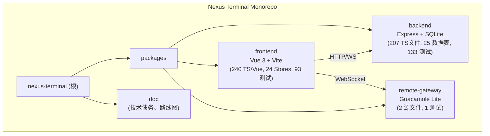
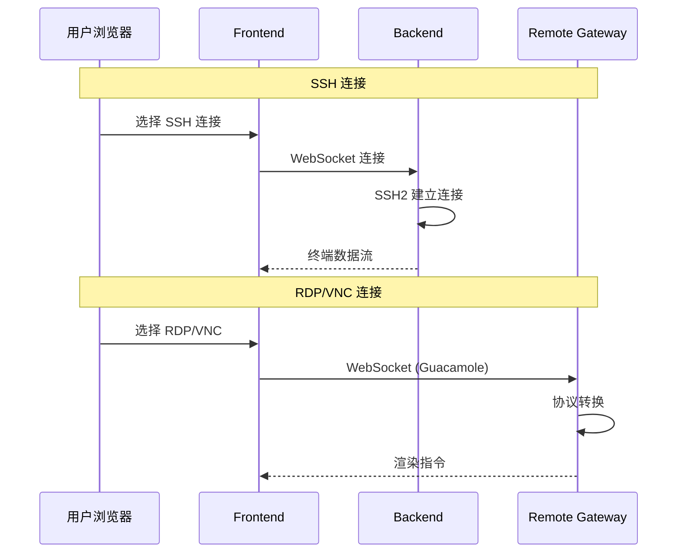

# 星枢终端（Nexus Terminal）

> 现代化、功能丰富的 Web SSH / RDP / VNC / Telnet 客户端，提供高度可定制的远程连接体验

---

## 项目愿景

星枢终端致力于提供一个现代化、轻量级且功能完备的 Web 远程管理平台，支持：

- **多协议连接**：SSH、SFTP、RDP、VNC、Telnet
- **多标签管理**：在单一浏览器窗口管理多个远程会话
- **会话挂起与恢复**：网络断开后自动保持会话，随时恢复
- **高度可定制**：终端主题、布局、背景动效、键盘映射
- **审计与监控**：完整的用户行为日志、通知系统（Webhook/Email/Telegram）
- **智能运维**：AI 智能助手、批量命令执行、系统健康分析
- **AI 安全审计**：基于规则引擎的异常检测、审计报告生成、风险评分
- **轻量化部署**：基于 Node.js 后端，资源占用低，支持 Docker 一键部署

---

## 架构总览

### 技术栈

- **前端**：Vue 3 + TypeScript + Vite + Pinia + Element Plus + Xterm.js + Monaco Editor
- **后端**：Node.js + Express + TypeScript + SQLite3 + SSH2 + WebSocket
- **远程桌面网关**：Guacamole Lite + Express + WebSocket
- **部署**：Docker Compose + Nginx 反向代理

### 架构模式

- **Monorepo**：npm workspaces 管理三个子包
- **前后端分离**：RESTful API + WebSocket 实时通信
- **微服务架构**：后端服务、前端应用、远程网关独立容器化部署

### 模块结构图



### 模块通信流程图



---

## 模块索引

| 模块               | 路径                      | TS 文件 | 职责                                                         | 文档                                                            |
| ------------------ | ------------------------- | ------- | ------------------------------------------------------------ | --------------------------------------------------------------- |
| **backend**        | `packages/backend`        | 207+    | SSH/Telnet/SFTP 连接、认证、审计、AI 审计、通知、Docker 管理 | [backend/CLAUDE.md](./packages/backend/CLAUDE.md)               |
| **frontend**       | `packages/frontend`       | 240+    | 终端界面、文件管理器、连接管理、AI 审计界面、主题定制        | [frontend/CLAUDE.md](./packages/frontend/CLAUDE.md)             |
| **remote-gateway** | `packages/remote-gateway` | 2       | RDP/VNC 连接代理                                             | [remote-gateway/CLAUDE.md](./packages/remote-gateway/CLAUDE.md) |

### 规划文档

| 文档                                     | 描述         |
| ---------------------------------------- | ------------ |
| [DESIGN.md](./DESIGN.md)                 | 项目设计文档 |
| [技术债务报告](./docs/technical/debt.md) | 技术债务报告 |
| [更新日志](./docs/changelog.md)          | 变更记录     |

---

## 运行与开发

### 快速启动（Docker）

```bash
mkdir nexus-terminal && cd nexus-terminal
wget https://raw.githubusercontent.com/Silentely/nexus-terminal/refs/heads/main/docker-compose.yml
wget https://raw.githubusercontent.com/Silentely/nexus-terminal/refs/heads/main/.env
docker compose up -d
# 访问 http://localhost:18111
```

### 本地开发

```bash
npm install                                    # 安装所有子包依赖
cd packages/backend && npm run dev             # 后端 :3001
cd packages/frontend && npm run dev            # 前端 :5173
cd packages/remote-gateway && npm run dev      # 网关 :8081/9090
```

### 构建生产版本

```bash
cd packages/backend && npm run build && npm start
cd packages/frontend && npm run build
```

### 环境变量

| 变量                      | 默认值         | 说明                      |
| ------------------------- | -------------- | ------------------------- |
| `PORT`                    | 3001           | API 端口                  |
| `ENCRYPTION_KEY`          | 自动生成       | 数据库加密密钥（32B hex） |
| `SESSION_SECRET`          | 自动生成       | 会话密钥                  |
| `GUACD_HOST`/`GUACD_PORT` | localhost:4822 | Guacamole daemon          |
| `ENABLE_METRICS`          | false          | Prometheus 端点           |
| `ENABLE_GEO_LOOKUP`       | true           | IP 地理位置查询           |
| `LOG_LEVEL`               | info           | 日志等级                  |

---

## 测试策略

### 测试命令

```bash
npm test                        # 所有单元测试
npm run test:backend            # 后端测试
npm run test:frontend           # 前端测试
npm run test:coverage           # 覆盖率报告
npm run test:e2e                # E2E 测试（Playwright）
npm run test:perf               # 性能测试
npx playwright install          # 首次运行 E2E 需安装浏览器
```

### 测试框架

- **单元测试**：Vitest（后端 + 前端）
- **E2E 测试**：Playwright（Chromium/Firefox/WebKit）
- **集成测试**：SSH/SFTP Mock 服务器 + Guacamole 协议模拟
- **性能测试**：Autocannon

### 测试编写要点

- 单元测试与被测文件同目录，命名 `*.test.ts`
- 集成测试放 `tests/integration/{功能}/`
- E2E 测试放 `e2e/tests/*.spec.ts`
- 使用中文描述测试套件和用例
- Mock 策略：Repository 用 `vi.mock()`，Store 用 `setActivePinia(createPinia())`
- 详细示例参见各模块 `CLAUDE.md` 或 `doc/TESTING_GUIDE.md`

### 覆盖率要求

| 模块类型   | 行覆盖率 | 分支覆盖率 |
| ---------- | -------- | ---------- |
| Service    | >=80%    | >=70%      |
| Controller | >=70%    | >=60%      |
| Repository | >=60%    | >=50%      |
| Utils      | >=90%    | >=80%      |
| Store      | >=80%    | >=70%      |
| Component  | >=60%    | >=50%      |

---

## 编码规范

### 语言与格式

- **语言**：TypeScript（严格模式）
- **文件名**：`kebab-case`（如 `auth.controller.ts`）
- **类名/接口**：`PascalCase`
- **变量/函数**：`camelCase`
- **常量**：`UPPER_SNAKE_CASE`

### 架构约定

- **后端分层**：`routes.ts` -> `controller.ts` -> `service.ts` -> `repository.ts`
- **前端**：Vue 3 Composition API + Pinia stores
- **所有 API 交互需有 TypeScript 类型定义**

### 依赖管理

- 生产依赖版本在 `package.json` 中明确锁定
- 定期 `npm audit` 检查漏洞
- 跨模块共享依赖提升至根 `package.json`

---

## AI 使用指引

### 上下文注入优先级

1. **优先读取**：根 `CLAUDE.md` -> 模块 `CLAUDE.md` -> `.claude/index.json`
2. **按需读取**：`schema.ts`（数据库）、`routes.ts`（API）、`stores/`（状态）

### 任务执行建议

- **新增功能**：读模块 CLAUDE.md -> 遵循分层约定创建文件 -> 更新文档
- **修改功能**：识别影响范围 -> 读当前实现 -> 运行测试 -> 更新文档
- **Bug 修复**：定位根因 -> 修复 -> 更新测试

---

## 附录

### 关键文件路径

| 类别          | 路径                                                   |
| ------------- | ------------------------------------------------------ |
| 数据库 Schema | `packages/backend/src/database/schema.ts`（24 表）     |
| 后端入口      | `packages/backend/src/index.ts`                        |
| 前端入口      | `packages/frontend/src/main.ts`                        |
| 后端路由      | `packages/backend/src/*/routes.ts`（24 模块）          |
| 前端路由      | `packages/frontend/src/router/index.ts`（9 视图）      |
| 状态管理      | `packages/frontend/src/stores/*.store.ts`（24 stores） |
| WebSocket     | `packages/backend/src/websocket.ts` + `handlers/`      |
| 加密模块      | `packages/backend/src/utils/crypto.ts`                 |

### 部署架构

```
Frontend (18111:8080) -> Nginx + Vite build
  | API 代理
Backend (3001) -> Express + SQLite + SSH2
  | WebSocket
Remote Gateway (8080/9090) -> Guacamole Lite + Guacd (4822)
```

### 数据持久化

- **SQLite**：`./data` 目录
- **会话**：`./data/sessions`
- **上传**：`./packages/backend/uploads`

---

## .context 项目上下文

> 项目使用 `.context/` 管理开发决策上下文。

- 编码规范：`.context/prefs/coding-style.md`
- 工作流规则：`.context/prefs/workflow.md`
- 决策历史：`.context/history/commits.md`

**规则**：修改代码前必读 prefs/，做决策时按 workflow.md 规则记录日志。
